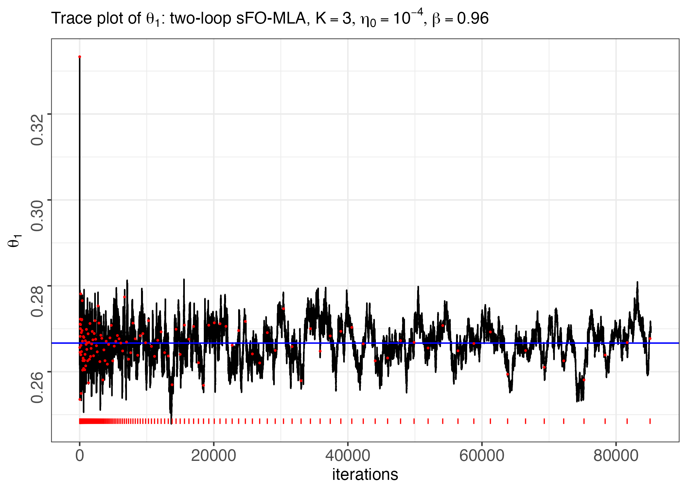
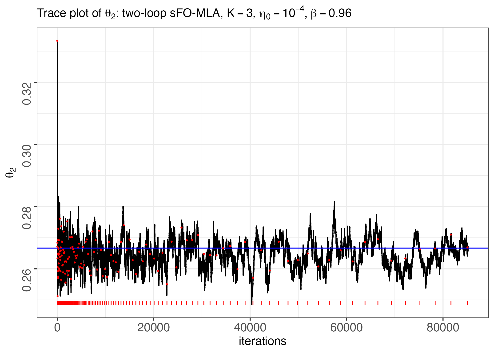

# sFO-MLA

R and Rcpp implementations of the stochastic first-order Mirror Langevin Algorithm (sFO-MLA) and its warm-started two-loop variant for sampling from constrained distributions.

The code accompanies the manuscript **"Two-Loop Stochastic Mirror Langevin Algorithms for Constrained Sampling."** It includes implementations and experiment scripts for Bayesian mixture-weight inference on the simplex and posterior sampling in Poisson graphical models with an intractable normalizing constant.

## Description

Mirror Langevin algorithms map a constrained sampling problem to an unconstrained dual space through a mirror map. Standard fixed-step implementations mix quickly at larger step sizes but retain a nonvanishing discretization error, while smaller step sizes reduce this error at the cost of slower mixing.

The two-loop sFO-MLA implementation uses a geometric step-size schedule. At each outer epoch, the algorithm runs a fixed-step sFO-MLA chain for a corresponding number of inner iterations and warm-starts the next epoch from the current endpoint. The accompanying paper establishes finite-time Wasserstein bounds separating transient mixing, Euler-Maruyama discretization, and stochastic-gradient errors, and shows that the two-loop construction attains an \(O(T^{-1/2})\) rate under the stated assumptions.

The repository contains two applications:

- **Bayesian mixture weights:** sampling mixture weights on a simplex, with stochastic gradients obtained by minibatching observations.
- **Poisson graphical models:** sampling a constrained posterior with an intractable normalizing constant, with stochastic gradients estimated by Monte Carlo simulation.

## Implementations

The repository distinguishes between a general-purpose implementation and optimized, model-specific experiment code:

- `man/sMLA.R` is the **general-purpose R implementation**. Its `sMLA()` interface accepts either a stochastic gradient function through `grad` or a zeroth-order objective through `Fn`, together with linear constraints `A %*% x <= b`.
- `mixture_model_code/sFO_MLA_mixture_model.cpp` is an **ad hoc Rcpp implementation** optimized for the Gaussian mixture-weight experiments.
- `PGM_code/PGM_sFO_MLA.cpp` is an **ad hoc Rcpp/RcppArmadillo implementation** optimized for the Poisson graphical model experiments.

The Rcpp code supports the two applications studied in the paper; it is not intended to be the general user interface. The demonstration below therefore uses `sMLA()` from `man/sMLA.R`.

## Installation

Clone the repository:

```bash
git clone https://github.com/RuitingDeposit/sFO-MLA.git
cd sFO-MLA
```

Install the package required by the general-purpose implementation:

```r
install.packages("nleqslv")
```

To reproduce the model-specific Rcpp experiments and figures, install the additional packages:

```r
install.packages(c(
  "Rcpp",
  "RcppArmadillo",
  "ks",
  "LaplacesDemon",
  "ggplot2",
  "latex2exp",
  "T4transport",
  "rmarkdown",
  "knitr"
))
```

The model-specific Rcpp implementations are compiled when `Rcpp::sourceCpp()` is called, so reproducing those experiments also requires a working C++ toolchain. The general-purpose demonstration below uses only the R implementation. This repository contains research scripts rather than an installable R package.

## Demonstration

### General-purpose sFO-MLA

The demonstration in `demo/sFO_MLA_mixed_dist.Rmd` simulates observations from a three-component Gaussian mixture and applies the general-purpose `sMLA()` function. Run the following code from the repository root.

```r
source("man/sMLA.R")

# Prepare data.
n <- 10000
d <- 3
alpha <- rep(2, d)
theta <- rep(0.8 / d, d - 1)
classes <- sample(
  1:d,
  size = n,
  prob = c(theta, 1 - sum(theta)),
  replace = TRUE
)

# The component densities are Gaussian with means 1, ..., d
# and standard deviation 0.2.
x <- rnorm(n, mean = 0, sd = 0.2) + classes

evaluate_normal_density <- function(s, std, l) {
  dens <- numeric(l)
  for (k in 1:l) {
    dens[k] <- dnorm(s, mean = k, sd = std)
  }
  dens
}

grad_est <- function(m, x, dat, alpha, std) {
  x <- c(x, 1 - sum(x))
  K <- length(x)
  n <- length(dat)
  grad <- numeric(K - 1)
  indices <- sample(1:n, size = m)

  for (j in 1:(K - 1)) {
    for (i in indices) {
      dens <- evaluate_normal_density(dat[i], std, l = K)
      temp <- x * dens
      grad[j] <- grad[j] -
        (dnorm(dat[i], mean = j, sd = std) -
           dnorm(dat[i], mean = K, sd = std)) / sum(temp)
    }
  }

  grad * n / m -
    (alpha[-K] - 1) / x[-K] +
    (alpha[K] - 1) / x[K]
}

A <- rbind(-diag(d - 1), rep(1, d - 1))
b <- c(rep(0, d - 1), 1)

result_d3 <- sMLA(
  grad = grad_est,
  x0 = rep(1 / d, d - 1),
  K = 135,
  eta0 = 1,
  rho = 0.96,
  lam = 1,
  multiplier = 15,
  A = A,
  b = b,
  scale = n,
  message = TRUE,
  dat = x,
  m = 2500,
  alpha = rep(2, d),
  std = 0.2
)
```

The returned list includes:

- `primal_samples`: samples in the constrained primal space at the outer epochs;
- `dual_samples`: corresponding samples in the unconstrained dual space;
- `all_x`: all inner-loop primal samples;
- `outer_loop_indices`: locations of outer-epoch endpoints among the inner samples;
- `time`: elapsed runtime.

The same example, organized as an R Markdown document, is available in `demo/sFO_MLA_mixed_dist.Rmd`.

The resulting traces for the two free mixture weights are shown below.

| Trace of \(\theta_1\) | Trace of \(\theta_2\) |
|:---:|:---:|
|  |  |

## Model-specific experiment implementations

The Rcpp code in `mixture_model_code/` and `PGM_code/` is used for the two experiments in the paper. These implementations trade generality for speed and are separate from the general-purpose demonstration above.

### Bayesian mixture weights

The mixture-weight experiment uses an ad hoc Rcpp implementation that directly evaluates the model-specific minibatch gradient and log posterior. The following small example illustrates this optimized interface. Run it from the repository root.

```r
library(Rcpp)

sourceCpp("mixture_model_code/sFO_MLA_mixture_model.cpp")

set.seed(1)

n <- 500L
d <- 3L
alpha <- rep(2, d)
true_weights <- c(0.2, 0.3, 0.5)
classes <- sample(1:d, n, replace = TRUE, prob = true_weights)
x <- rnorm(n, mean = classes, sd = 0.2)

A <- rbind(-diag(d - 1), rep(1, d - 1))
b <- c(rep(0, d - 1), 1)

result_cpp <- DMLA_new_grad_cpp_mix_lglik(
  theta0 = rep(1 / d, d - 1),
  x = x,
  alpha = alpha,
  B = 20L,
  eta0 = 0.05,
  rho = 0.96,
  lam = 1,
  multiplier = 0.05,
  A = A,
  b = b,
  scale = n,
  message = TRUE,
  m = 100L,
  std = 0.2
)
```

The full mixture-model sampling, fixed-step and MH-corrected comparisons, Wasserstein-distance calculations, and plotting workflows are provided in `mixture_model_code/sFO_MLA_mixed_dist_main_experiments.Rmd` and the other R Markdown files in that directory.

### Poisson graphical model

The Poisson graphical model experiment uses an ad hoc implementation combining R helper functions with Rcpp/RcppArmadillo routines. It is included to reproduce the paper's PGM study rather than as the general-purpose interface. Run the following setup from the repository root:

```r
setwd("PGM_code")

source("PGM.R")
source("PGM_sFO_MLA_functions.R")
```

The complete data-generation, two-loop sampling, exchange-algorithm comparison, and plotting workflow is provided in `PGM_sFO_MLA.Rmd`. The manuscript experiments use \(p=4\) and \(p=5\), with 500 observations generated from a Poisson graphical model whose diagonal parameters are 1 and whose off-diagonal parameters are -0.1.

## Reproducing the experiments

The main experiment files are:

```text
demo/
  sFO_MLA_mixed_dist.Rmd             # General-purpose R demonstration
man/
  sMLA.R                             # General-purpose implementation
mixture_model_code/
  sFO_MLA_mixture_model.cpp          # Ad hoc mixture-model Rcpp code
  sFO_MLA_mixed_dist_main_experiments.Rmd
  sFO_MLA_mixed_dist_Plots.Rmd
  sFO_mixed_dist_test_minibatch_effect.Rmd
PGM_code/
  PGM.R
  PGM_sFO_MLA.cpp                    # Ad hoc PGM Rcpp code
  PGM_sFO_MLA_functions.R
  PGM_sFO_MLA.Rmd
```

The mixture-model experiments consider $K \in \{30, 50, 80, 100\}$, use $n=10{,}000$ observations, a minibatch size of 2,500, geometric decay factor `rho = 0.96`, and 135 outer samples. The PGM experiments use Monte Carlo estimates of the intractable likelihood contribution and compare two-loop sFO-MLA with an exchange-algorithm correction.

The experiment notebooks use paths relative to their own directories. Set the working directory to `mixture_model_code/` or `PGM_code/` before running their chunks. Some plotting chunks load previously generated `.RDS` files that are not included in the repository; run the corresponding sampling and data-generation chunks first, create the referenced output directories, and then run the plotting chunks.

## Reference

*Two-Loop Stochastic Mirror Langevin Algorithms for Constrained Sampling.* Manuscript under review, 2026.

If you use this code, please cite the paper. Full bibliographic information will be added when the manuscript becomes publicly available.
